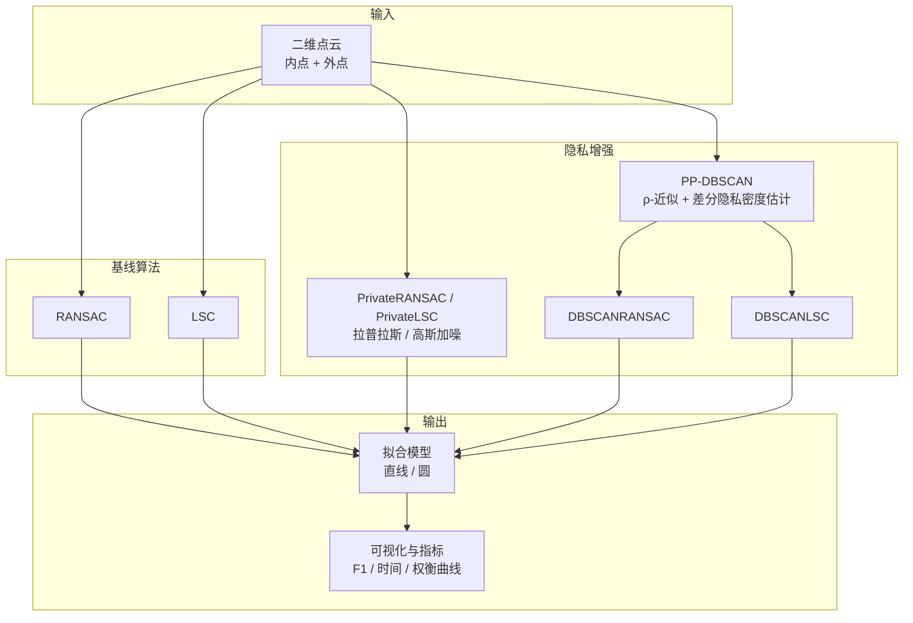

# Design and Implementation of Robust Model Fitting Algorithms for Differential Privacy

> 基于差分隐私与 PP-DBSCAN 的二维点云鲁棒拟合实验框架  
> 毕业设计 · Python 实现

[](https://www.python.org/)
[](https://numpy.org/)
[](#许可证)

在含噪声与异常值的二维点云场景下，对比 **RANSAC**、**LSC** 及其隐私增强变体，评估差分隐私（DP）与隐私保护 DBSCAN（PP-DBSCAN）对直线/圆拟合精度与效用的影响。

---

## 目录

- [项目亮点](#项目亮点)
- [算法架构](#算法架构)
- [快速开始](#快速开始)
- [项目结构](#项目结构)
- [核心模块](#核心模块)
- [实验流程](#实验流程)
- [输出文件](#输出文件)
- [参数配置](#参数配置)
- [评估指标](#评估指标)
- [常见问题](#常见问题)
- [致谢](#致谢)
- [许可证](#许可证)

---

## 项目亮点

| 能力 | 说明 |
|------|------|
| **鲁棒拟合** | 实现 RANSAC、LSC，支持直线与圆模型拟合 |
| **差分隐私** | 拉普拉斯 / 高斯机制对点集与模型参数加噪 |
| **PP-DBSCAN** | ρ-近似密度聚类 + 隐私距离估计，与 RANSAC/LSC 融合 |
| **系统对比** | 原始 / DP / PP-DBSCAN 三路拟合效果并排可视化 |
| **效用评估** | F1、精确率、召回率、执行时间及隐私-精度权衡曲线 |

---

## 算法架构



**对比维度：**

1. **原始算法**：直接在含外点的点集上拟合  
2. **差分隐私（DP）**：对点集加噪后再拟合，ε 越小隐私越强  
3. **PP-DBSCAN 融合**：先隐私聚类去噪，再对主簇执行 RANSAC / LSC  

---

## 快速开始

### 环境要求

- Python **3.8+**
- 依赖：`numpy`、`scikit-learn`、`matplotlib`

### 安装依赖

```bash
pip install numpy scikit-learn matplotlib
```

或使用 `requirements.txt`（若已添加）：

```bash
pip install -r requirements.txt
```

### 运行实验

在项目根目录执行：

```bash
python main.py
```

程序将依次完成：

1. 生成直线与圆测试数据（默认 200 内点 + 100 外点）  
2. 运行 7 种直线拟合算法与 6 种圆拟合算法  
3. 打印 F1、执行时间等指标  
4. 保存全部对比图与隐私权衡曲线  

终端输出示例：

```
[1/5] 运行原始RANSAC...
  F1分数: 0.xxxx, 时间: xx.xxms
...
所有可视化图表已生成并保存！
```

---

## 项目结构

```
.
├── main.py                 # 主入口：实验流程、算法调度、图表生成
├── geometry.py             # Point2D、LineModel、CircleModel、FittingResult
├── ransac.py               # RANSAC 直线 / 圆拟合
├── lsc.py                  # LSC（潜在语义聚类）拟合
├── privacy.py              # 差分隐私机制与 PrivateRANSAC / PrivateLSC
├── dbscan_privacy.py       # PrivacyPreservingDBSCAN、DBSCANRANSAC、DBSCANLSC
├── utils.py                # 数据生成、性能评估、DP 效用分析
├── visualization.py        # matplotlib 可视化
├── README.md
└── *.svg / *.png           # 实验结果图表（运行后生成）
```

---

## 核心模块

### `PrivacyPreservingDBSCAN`（`dbscan_privacy.py`）

隐私保护密度聚类，参考 PPA-DBSCAN 思路：

- ρ-近似距离计算，降低隐私泄露  
- 密度估计中注入拉普拉斯噪声  
- `fit(points)` → 聚类标签；`get_private_points(points)` → 隐私化点集  

### `PrivateRANSAC` / `PrivateLSC`（`privacy.py`）

| 方法 | 说明 |
|------|------|
| `get_noisy_points(points)` | 对坐标施加拉普拉斯或高斯噪声 |
| `fit_line(points)` | 在隐私化点集上拟合直线 |
| `fit_circle(points)` | 在隐私化点集上拟合圆 |

### `DBSCANRANSAC` / `DBSCANLSC`（`dbscan_privacy.py`）

先 PP-DBSCAN 聚类并选取最大簇，再调用 RANSAC 或 LSC 完成拟合。

### `RANSAC` / `LSC`（`ransac.py`、`lsc.py`）

| 算法 | 直线最小样本 | 圆最小样本 | 特点 |
|------|-------------|-----------|------|
| RANSAC | 2 | 3 | 随机采样 + 内点一致性 |
| LSC | 2 | 3 | 候选模型 + SVD 潜在语义 + KMeans 选模 |

---

## 实验流程

```
生成数据 → 多算法拟合 → 计算指标 → 生成对比图
    │            │              │            │
    ├─ 直线      ├─ 原始         ├─ F1        ├─ 拟合效果图
    └─ 圆        ├─ DP           ├─ 时间      ├─ 隐私点集对比
                 └─ PP-DBSCAN    └─ DP 效用   └─ 权衡曲线
```

1. `utils.generate_line_data()` / `generate_circle_data()` 合成带外点的点云  
2. 各算法调用 `fit_line()` 或 `fit_circle()` 得到 `FittingResult`  
3. `utils.evaluate_algorithm()` 计算分类指标  
4. `utils.evaluate_dp_robust_fitting()` 对比原始与隐私化点集上的拟合效用  
5. `visualization` 模块输出 PNG 图表  

---

## 输出文件

运行 `main.py` 后主要生成以下图像（部分与仓库内 SVG 同名）：

| 文件名 | 内容 |
|--------|------|
| `line_fitting.png` | 直线：多算法拟合总览 |
| `circle_fitting.png` | 圆：多算法拟合总览 |
| `performance_line.png` / `performance_circle.png` | F1、时间等性能柱状图 |
| `privacy_data_line.png` / `privacy_data_circle.png` | 弱/强隐私预算下的加噪对比 |
| `orig vs privacy_points_*.png` | 原始点集 vs DP 加噪点集 |
| `dp_robust_evaluation_*.png` | DP 下鲁棒拟合效用评估 |
| `orig vs dp vs ppdbscan_*.png` | 原始 / DP / PP-DBSCAN 三路对比 |
| `privacy_tradeoff.png` | 不同 ε 下的 F1 权衡曲线 |

---

## 参数配置

在 `main.py` 顶部可调整实验参数：

| 参数 | 默认值 | 含义 |
|------|--------|------|
| `num_inliers` | 200 | 内点数量 |
| `num_outliers` | 100 | 外点数量 |
| `noise_level` | 0.5 | 内点高斯噪声强度 |
| `weak_privacy_epsilon` | 2.0 | 弱隐私预算 ε |
| `strong_privacy_epsilon` | 0.2 | 强隐私预算 ε（主对比） |
| `privacy_sensitivity` | 1.5 | 差分隐私敏感度 Δ |

PP-DBSCAN 相关参数（在算法实例化处修改）：

| 参数 | 直线典型值 | 圆典型值 | 含义 |
|------|-----------|---------|------|
| `eps` | 2.0 | 2.5 | 邻域半径 |
| `min_samples` | 5 | 5 | 核心点最小邻居数 |
| `rho` | 0.1 | 0.1 | ρ-近似参数 |

RANSAC / LSC 共用：

| 参数 | 默认值 | 含义 |
|------|--------|------|
| `max_iterations` / `num_samples` | 1000 | 最大迭代 / 采样次数 |
| `threshold` | 1.0 | 内点距离阈值 |

---

## 评估指标

`PerformanceMetrics`（`utils.py`）包含：

- **Accuracy** — 内点/外点分类准确率  
- **Precision / Recall / F1** — 以内点识别为二分类任务  
- **execution_time_ms** — 算法耗时（毫秒）  
- **iterations** — RANSAC 实际迭代次数  

`evaluate_dp_robust_fitting()` 额外报告隐私化点集上的拟合偏差与效用损失。

---

## 常见问题

**Q: 提示 `ModuleNotFoundError`？**  
A: 执行 `pip install numpy scikit-learn matplotlib` 安装依赖。

**Q: 图表不显示？**  
A: 本项目默认将图表保存为 PNG，无需 GUI；若在无头服务器运行，可设置 `matplotlib` 后端：

```python
import matplotlib
matplotlib.use('Agg')
```

**Q: 每次结果略有不同？**  
A: 数据生成固定 `seed=42`，但差分隐私与 RANSAC 含随机性，多次运行 F1 会有小幅波动。

**Q: 如何使用自己的点云？**  
A: 构造 `List[Point2D]`，调用各算法的 `fit_line()` 或 `fit_circle()`，并传入 `ground_truth_inliers` 索引列表用于评估。

---

## 致谢

若本项目对您的研究或课程有帮助，欢迎 Star 本仓库。

---

## 许可证

本项目暂未指定开源许可证。如需上传到 GitHub，可自行添加 `LICENSE` 文件（如 MIT、Apache-2.0 等）。
